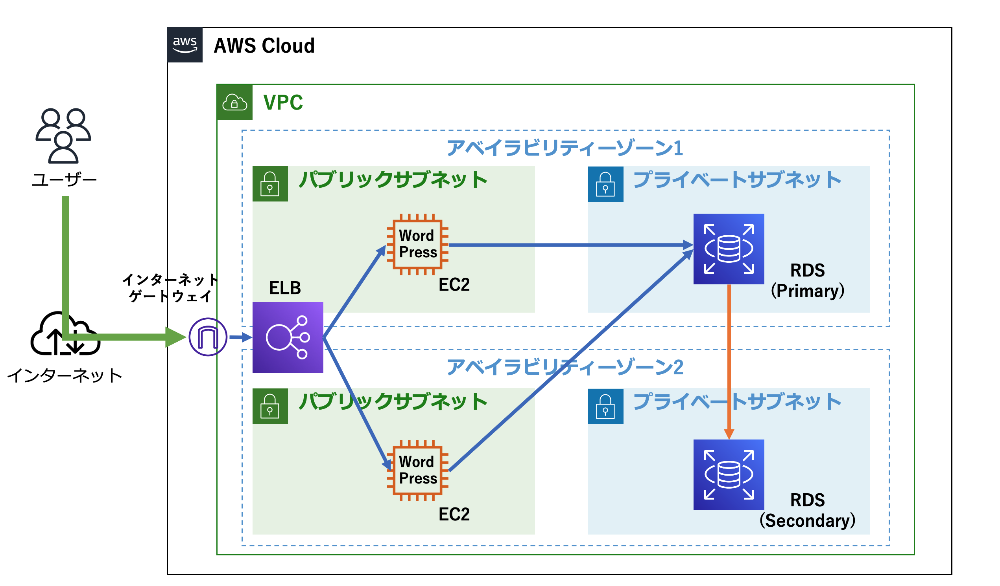

# Welcome to your CDK TypeScript project

You should explore the contents of this project. It demonstrates a CDK app with an instance of a stack (`CdkWorkshopStack`)
which contains an Amazon SQS queue that is subscribed to an Amazon SNS topic.

The `cdk.json` file tells the CDK Toolkit how to execute your app.

## Useful commands

* `npm run build`   compile typescript to js
* `npm run watch`   watch for changes and compile
* `npm run test`    perform the jest unit tests
* `cdk deploy`      deploy this stack to your default AWS account/region
* `cdk diff`        compare deployed stack with current state
* `cdk synth`       emits the synthesized CloudFormation template

## 自分用メモ

### 概要

本リポジトリは，AWS CDKを利用することで，WordPressのホームページを運用するためのアーキテクチャを自動構築するためのコードが格納されている．
具体的には，以下の構成のサービスを自動構築する．なお，CDKアプリケーションのメインスタックは `lib/cdk-workshop-stack.ts` に定義しており，CDKアプリケーションのエントリポイントは，`bin/cdk-workshop.ts` である．`bin/cdk-workshop.ts` では，`lib/cdk-workshop-stack.ts` で定義されたスタックをロードする．
加え，Webサーバーインスタンスのコンストラクトを `lib/constructs/web-server-instance.ts` に定義しており， `lib/cdk-workshop-stack.ts` から import している．



### 実行手順

CDK アプリを合成する．ここで「合成」とは，AWS CloudFormationテンプレートを生成することを意味する．CloudFormationテンプレートは `cdk.out/` ディレクトリに自動出力される．

```sh
cdk synth
```

利用しているAWSアカウント内て初めてAWS CDKを利用する場合は，ブーストラップスタックをデプロイする．（AWS CDKが利用するS3バケットなどのデプロイのことである）

```sh
cdk boostrap
```

CDK アプリケーションをデプロイする．

```sh
cdk deploy
```

CDK スタックを削除する．
```sh
cdk destroy
```

### 参考

- [AWS workshop TypeScript の基礎から始める AWS CDK 開発入門](https://catalog.workshops.aws/typescript-and-cdk-for-beginner/ja-JP)